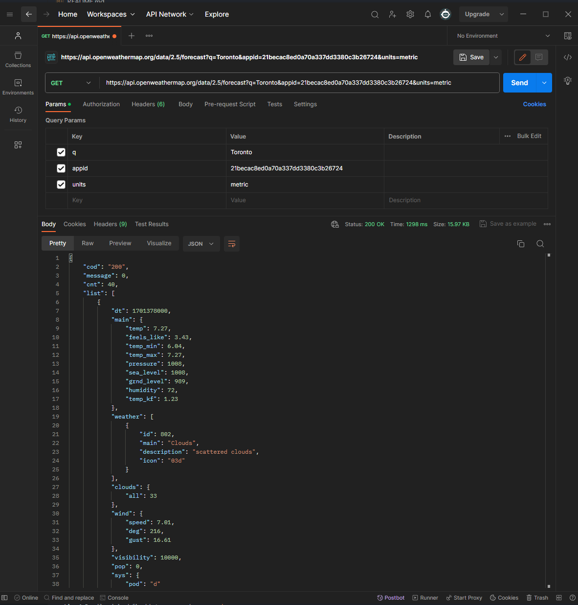
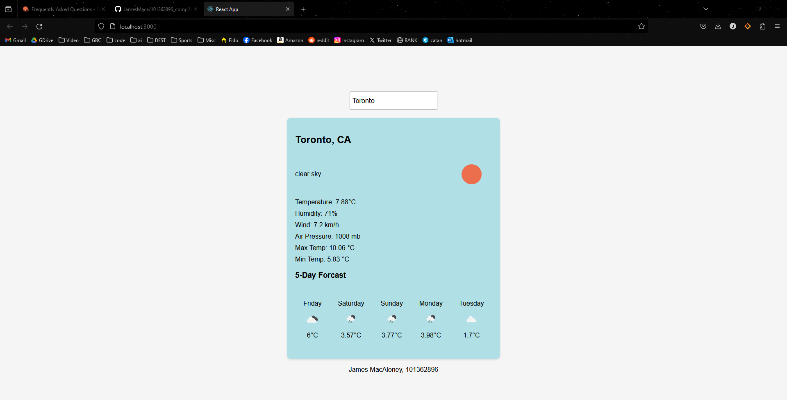

101362896_comp3121_labtest2
James MacAloney - 101362896

1. Screenshot for Postamn testing get request to get weather data for Toronto in metric units of measurement

2. Screenshot of my React.js app i created, domonstracting the curent weather with icons and other weather details. Also diplaying the temp for the next 5 days with icons and weekdays

